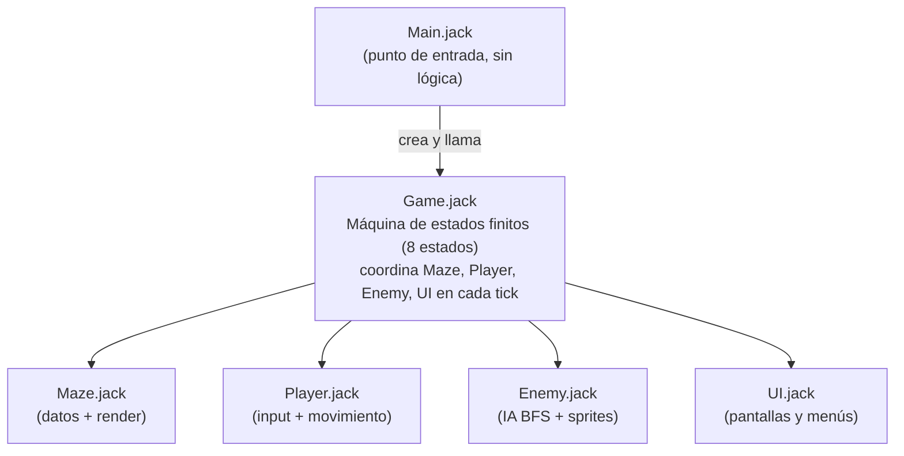
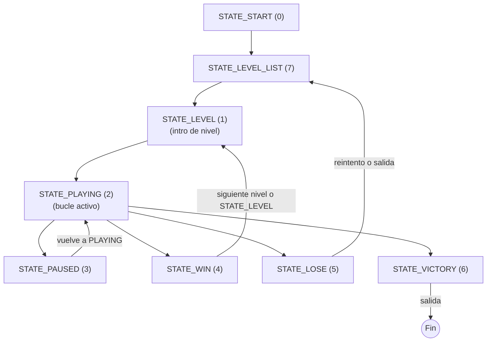

# Maze Intelligence

> Videojuego de laberinto con inteligencia artificial para la plataforma Nand2Tetris (Jack / Hack VM)

---

## Tabla de contenidos

1. [Descripción general](#descripción-general)
2. [Estructura del repositorio](#estructura-del-repositorio)
3. [Requisitos del sistema](#requisitos-del-sistema)
4. [Compilación y ejecución](#compilación-y-ejecución)
5. [Guía de usuario](#guía-de-usuario)
6. [Arquitectura del proyecto](#arquitectura-del-proyecto)
7. [Documentación de clases](#documentación-de-clases)
8. [Diseño de niveles](#diseño-de-niveles)
9. [Sistema de sprites](#sistema-de-sprites)
10. [Inteligencia artificial del enemigo](#inteligencia-artificial-del-enemigo)
11. [Gestión de memoria](#gestión-de-memoria)
12. [Créditos e integrantes](#créditos-e-integrantes)

---

## Descripción general

**Maze Intelligence** es un videojuego de laberinto de 3 niveles implementado íntegramente en el lenguaje **Jack**, diseñado para ejecutarse sobre la máquina virtual **Hack** del proyecto educativo [Nand2Tetris](https://www.nand2tetris.org/).

El jugador controla a una criatura presa (Ratón, Ardilla o Pájaro según el nivel) que debe escapar a través de un laberinto mientras es perseguida por uno o dos enemigos con inteligencia artificial (Gato o Serpientes). Cada nivel aumenta la complejidad del laberinto, la velocidad de los enemigos y el número de perseguidores.

La pantalla Hack es de **512 × 256 píxeles** en blanco y negro. El grid del laberinto ocupa **272 × 176 px** (11 filas × 17 columnas, celdas de 16 × 16 px), dejando margen para las pantallas de menú dibujadas con pixel art construido con primitivas de dibujo.

Lo que hace especial a este proyecto es que **no utiliza ninguna librería de juegos ni motor externo**. Cada píxel de cada sprite, cada pantalla de menú y cada comportamiento de la IA fue construido desde cero en un lenguaje diseñado para ser simple. El resultado es un juego completamente funcional corriendo sobre una arquitectura de computadora implementada manualmente en hardware lógico.

---

## Estructura del repositorio

```text
Proyecto_final/
├── README.md                           ← Documentación principal (este archivo)
└── OrganizacionComputadores/           ← Submódulo y repositorio principal
    ├── CHANGELOG.md                    ← Registro de cambios
    ├── CONTRIBUTORS.md                 ← Lista de contribuidores
    ├── LICENSE.md                      ← Licencia del proyecto
    └── Proyecto_final/
        ├── docs/                       ← Documentación extendida
        │   ├── User_Guide.md           ← Guía completa del jugador
        │   └── Clases.md               ← Documentación técnica de clases y diagramas
        └── src/                        ← Código fuente Jack
            ├── Main.jack               ← Punto de entrada del programa
            ├── Game.jack               ← Máquina de estados y coordinador principal
            ├── Maze.jack               ← Datos del laberinto y renderizado de celdas
            ├── Player.jack             ← Input de teclado, movimiento y sprite del jugador
            ├── Enemy.jack              ← IA BFS, control de velocidad y sprite del enemigo
            ├── UI.jack                 ← Todas las pantallas, menús y títulos en pixel art
            └── Random.jack             ← Generador de números pseudoaleatorios
        
```

> Los archivos `.vm` no se versionan: se generan localmente ejecutando el JackCompiler sobre la carpeta `src/`.

---

## Requisitos del sistema

| Componente | Versión recomendada |
|---|---|
| Nand2Tetris Software Suite | 2.6 o superior |
| JackCompiler | Incluido en la suite |
| VMEmulator | Incluido en la suite |
| Java Runtime | 8 o superior |

Descarga la suite oficial en: [https://www.nand2tetris.org/software](https://www.nand2tetris.org/software)

---

## Compilación y ejecución

### Paso 1 — Compilar los archivos `.jack`

Abre el **JackCompiler** de Nand2Tetris y apúntalo a la carpeta completa del proyecto. Esto generará un archivo `.vm` por cada clase Jack.

Desde la línea de comandos (si tienes el compilador en el PATH):

```
JackCompiler <ruta-a-la-carpeta-del-proyecto>
```

Los archivos `.vm` generados serán:

```
Main.vm  ·  Game.vm  ·  Maze.vm  ·  Player.vm  ·  Enemy.vm  ·  UI.vm  ·  Random.vm
```

### Paso 2 — Ejecutar en el VMEmulator

1. Abre el **VMEmulator**.
2. Carga la **carpeta completa** del proyecto (no un solo archivo `.vm`), para que el emulador resuelva todas las dependencias entre clases.
3. Ajusta la velocidad de animación a **No animation** para obtener la cadencia correcta de ~16 ms por tick.
4. Haz clic en **Run**.

> **Nota importante:** Carga siempre la carpeta completa. El emulador necesita todas las clases juntas, incluidas las del sistema operativo Hack que la suite provee automáticamente. Cargar un solo `.vm` causará errores de símbolo no resuelto.

### Alternativa — Compilación y ejecución con Nand2Tetris IDE (Online)

Si no deseas descargar la suite en tu equipo, puedes compilar y jugar directamente en tu navegador:
1. Ve al [Nand2Tetris Web IDE](https://nand2tetris.github.io/web-ide/).
2. Abre la herramienta **Jack Compiler** en el panel izquierdo.
3. Haz clic en **Upload folder** (o en el icono de carpeta) y selecciona la carpeta `src` de tu proyecto local.
4. Compila todos los archivos haciendo clic en **Compile**.
5. Ve a la herramienta **VM Emulator**.
6. Haz clic en **Upload files** y selecciona todos los archivos `.vm` recién generados.
7. Ajusta la velocidad de animación a **No animation**.
8. Presiona **Run** para jugar.

---

## Guía de usuario

Para instrucciones detalladas de juego, controles y descripción de todas las pantallas, consulta [`User_Guide.md`](./User_Guide.md).

### Resumen de controles

| Acción | Teclas |
|---|---|
| Mover arriba | `W` / `w` / `↑` |
| Mover abajo | `S` / `s` / `↓` |
| Mover izquierda | `A` / `a` / `←` |
| Mover derecha | `D` / `d` / `→` |
| Pausar / Reanudar | `P` / `p` |
| Continuar (menús) | `Espacio` |
| Reintentar | `R` / `r` |
| Salir | `Q` / `q` |

---

## Arquitectura del proyecto

El proyecto sigue una arquitectura en capas donde cada clase tiene una responsabilidad única y bien delimitada.



### Flujo de estados de `Game`



---

## Documentación de clases

La documentación técnica completa —incluyendo diagrama de clases UML, diagrama de flujo de ejecución y descripción de cada método— está en [`Clases.md`](./Clases.md).

---

## Diseño de niveles

Los tres laberintos comparten la misma cuadrícula de 11×17 celdas. Cada celda mide 16×16 px. Las filas 0 y 10 son siempre bordes sólidos de muros; las columnas 0 y 16 son siempre muros laterales.

### Nivel 1 — Gato vs. Ratón `[Fácil]`

Laberinto abierto con pasillos anchos y múltiples rutas alternativas. El gato parte desde distintas posiciones en cada partida. La distancia inicial entre el jugador y el enemigo es grande, dando tiempo suficiente para orientarse antes de que el gato encuentre la ruta óptima.

### Nivel 2 — Gato vs. Ardilla `[Normal]`

Pasillos más estrechos que obligan a tomar rutas más largas. La salida se ubica en un lugar estratégico que maximiza la distancia de recorrido, exponiendo más a la ardilla al acecho del gato.

### Nivel 3 — 2 Serpientes vs. Pájaro `[Extrema]`

El laberinto muy denso con pasillos de 1 celda de ancho y pocas bifurcaciones. Dos enemigos activos (serpientes) patrullan al mismo tiempo con una velocidad de movimiento superior a la del jugador. La salida se encuentra en una ubicación que dificulta la navegación, obligando al jugador a evitar a ambos depredadores simultáneamente.

---

## Sistema de sprites

Todos los sprites son imágenes de 16×16 px en blanco y negro construidas con llamadas a `Screen.drawRectangle` y `Screen.drawLine`. No se usan bitmaps ni assets externos; cada píxel se define en código.

### Jugadores (presas) — fondo blanco, detalles negros

| Nivel | Personaje | Rasgos visuales |
|---|---|---|
| 1 | Ratón | Cara rectangular blanca, orejas cuadradas grandes, bigotes finos, boca sonriente |
| 2 | Ardilla | Mejillas abultadas, orejas puntiagudas, dientes prominentes |
| 3 | Pájaro | Copete de plumas, pico triangular, ojos con brillo especular |

### Enemigos (depredadores) — fondo negro, detalles blancos

| Nivel | Personaje | Rasgos visuales |
|---|---|---|
| 1 | Gato | Estilo kawaii: cara negra redonda, orejas suaves, ojazos con brillo (glint), bigotitos |
| 2 | Gato | Mismo diseño del gato, adaptado al laberinto de dificultad normal |
| 3 | Serpiente | Cabeza elongada negra, ojos de reptil con pupila vertical, escamas, lengua bífida |

El contraste entre caras blancas (jugador) y caras negras (enemigo) permite identificación visual inmediata en la pantalla monocromática.

---

## Inteligencia artificial del enemigo

Los enemigos utilizan **Búsqueda en Anchura (BFS)** completa para encontrar la ruta óptima hacia el jugador en cada tick de movimiento.

### Algoritmo BFS

En cada actualización:

1. Se inicializa el campo de distancias `sharedDistField[187]` a `9999` para todas las celdas.
2. Se ejecuta un BFS desde la posición del jugador (o su posición predicha en el caso del tipo 2), inundando el laberinto hacia afuera e inscribiendo la distancia mínima en cada celda alcanzable.
3. El enemigo evalúa sus cuatro vecinos ortogonales y se mueve al que tenga el valor más bajo en `sharedDistField`.

Este enfoque garantiza la **ruta óptima absoluta**: el enemigo nunca queda atrapado en un callejón ni oscila entre dos celdas porque no está maximizando localmente, sino siguiendo un gradiente global precalculado.

### Optimización de memoria: arrays BFS estáticos

Los arrays `sharedDistField` y `sharedBfsQueue` (de 187 elementos cada uno) son campos **`static`** de la clase `Enemy`. Esto significa que se asignan una sola vez al inicio del programa y son compartidos por todos los enemigos activos, lo cual es seguro porque Jack es single-threaded. Sin esta optimización, cada reinicio del nivel asignaba nuevos arrays en el heap, fragmentando la memoria de la plataforma Hack y causando el error `ERR6` en pocos reinicios.

### Control de velocidad

Cada enemigo tiene su propio par `moveTimer` / `moveInterval`. El BFS solo se ejecuta cuando `moveTimer ≥ moveInterval`, tras lo que se reinicia. Los intervalos en ticks por nivel son `8`, `7` y `3` respectivamente.

---

## Gestión de memoria

El entorno Hack tiene un heap muy limitado. El juego implementa varias estrategias defensivas:

**Destrucción explícita en cada transición de nivel.** `Game.loadLevel()` llama a `dispose()` en todos los objetos del nivel anterior antes de instanciar los nuevos. Cada clase implementa `dispose()` con una llamada a `Memory.deAlloc(this)`.

**Arrays BFS estáticos.** Como se describió arriba, los buffers grandes de la IA se asignan una sola vez.

**Nulificación de punteros.** Tras cada `dispose()`, los campos se verifican con `~(obj = null)` antes de operar, evitando double-free.

**Sin opción de "jugar de nuevo" en la victoria.** Reiniciar el juego completo desde la pantalla de victoria exigiría liberar y recrear todos los objetos, lo que puede causar fragmentación severa en el heap Hack. La pantalla de victoria solo ofrece salir.

---

## Créditos e integrantes

Proyecto desarrollado íntegramente en el lenguaje **Jack** para la plataforma educativa **Nand2Tetris**.

Plataforma: [nand2tetris.org](https://www.nand2tetris.org)

- **Isabella Cadavid Posada**
- **Wendy Vanessa Atehortua Chaverra**